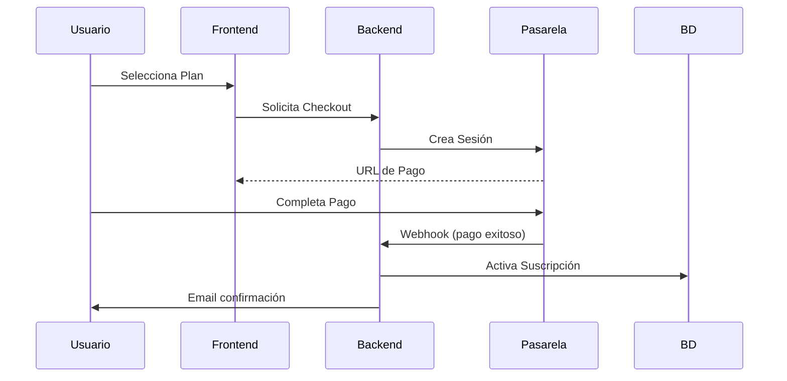

# 🚀 Conversión a Modelo SaaS - Evolve Soluciones

## 📋 Tabla de Contenidos

1. [Resumen Ejecutivo](#resumen-ejecutivo)
2. [Arquitectura del Sistema](#arquitectura-del-sistema)
3. [Modelo de Negocio](#modelo-de-negocio)
4. [Planes y Precios](#planes-y-precios)
5. [Integración de Pagos](#integración-de-pagos)
6. [Implementación Técnica](#implementación-técnica)
7. [Guía de Despliegue](#guía-de-despliegue)
8. [Métricas y Analytics](#métricas-y-analytics)
9. [Siguientes Pasos](#siguientes-pasos)

---

## 🎯 Resumen Ejecutivo

Esta documentación describe la conversión de Evolve Soluciones de un sistema tradicional a un modelo **Software as a Service (SaaS)** completamente funcional con:

- ✅ **Sistema de suscripciones** con múltiples planes
- ✅ **Integración de pagos** (Stripe, MercadoPago)
- ✅ **Arquitectura multi-tenant** robusta
- ✅ **Portal de autoservicio** para clientes
- ✅ **Panel de administración** con métricas
- ✅ **Facturación automática** y gestión de cobros

### Beneficios Clave

- 📈 **Ingresos Recurrentes**: Modelo de suscripción mensual/anual
- 🎨 **Escalabilidad**: Arquitectura preparada para miles de clientes
- 💰 **Reducción de Costos**: Automatización de procesos de venta y cobro
- 🔄 **Auto-servicio**: Clientes pueden registrarse y pagar sin intervención manual
- 📊 **Métricas en Tiempo Real**: MRR, churn, LTV y más

---

## 🏗️ Arquitectura del Sistema

### Componentes Principales

```
┌─────────────────────────────────────────────────────────────┐
│                     EVOLVE SOLUCIONES SAAS                  │
├─────────────────────────────────────────────────────────────┤
│                                                             │
│  ┌──────────────┐  ┌──────────────┐  ┌──────────────┐    │
│  │   Frontend   │  │   Backend    │  │   Database   │    │
│  │   (Jinja2)   │  │   (Flask)    │  │ (PostgreSQL) │    │
│  └──────────────┘  └──────────────┘  └──────────────┘    │
│         │                 │                   │            │
│         └─────────────────┴───────────────────┘            │
│                           │                                 │
│                           ▼                                 │
│         ┌──────────────────────────────────┐              │
│         │    Pasarelas de Pago             │              │
│         │  - Stripe                        │              │
│         │  - MercadoPago                   │              │
│         │  - Webpay (futuro)               │              │
│         └──────────────────────────────────┘              │
│                                                             │
└─────────────────────────────────────────────────────────────┘
```

### Modelo de Datos

#### Tablas Principales

1. **`planes_suscripcion`**: Define los planes disponibles
2. **`suscripciones`**: Suscripciones activas de clientes
3. **`transacciones`**: Historial de pagos
4. **`metodos_pago`**: Métodos de pago de clientes
5. **`modulos_plan`**: Relación entre planes y módulos

### Multi-Tenancy

El sistema utiliza **multi-tenancy a nivel de base de datos**:

- Cada cliente tiene su propia base de datos MySQL
- Los datos de autenticación y suscripción están centralizados en PostgreSQL
- Aislamiento completo de datos entre clientes

---

## 💼 Modelo de Negocio

### Flujo de Ingresos

1. **Suscripciones Mensuales**: Pago recurrente cada mes
2. **Suscripciones Anuales**: Pago anual con descuento (15-20%)
3. **Upgrades**: Cambios de plan con cobro prorrateado
4. **Servicios Premium**: Implementaciones personalizadas (futuro)

### Métricas Clave (KPIs)

- **MRR (Monthly Recurring Revenue)**: Ingresos recurrentes mensuales
- **ARR (Annual Recurring Revenue)**: Ingresos recurrentes anuales
- **Churn Rate**: Tasa de cancelación de clientes
- **LTV (Lifetime Value)**: Valor del cliente en su ciclo de vida
- **CAC (Customer Acquisition Cost)**: Costo de adquisición de cliente
- **LTV:CAC Ratio**: Razón entre LTV y CAC (ideal >3:1)

---

## 💰 Planes y Precios

### Plan Gratuito (Freemium)
**$0 / mes**

- ✅ 1 usuario
- ✅ Hasta 5 empresas
- ✅ 100 transacciones/mes
- ✅ 1 GB de almacenamiento
- ✅ Módulos básicos (Inicio, Consulta F29)
- ❌ Sin soporte técnico

**Ideal para**: Probar el sistema, emprendedores individuales

### Plan Básico
**$29.990 / mes** o **$299.900 / año** (ahorro 17%)

- ✅ 3 usuarios
- ✅ Hasta 15 empresas
- ✅ 500 transacciones/mes
- ✅ 5 GB de almacenamiento
- ✅ 5 módulos incluidos
- ✅ Soporte por email
- ✅ 14 días de prueba gratis

**Ideal para**: Contadores independientes, consultorías pequeñas

### Plan Profesional ⭐ (Recomendado)
**$59.990 / mes** o **$599.900 / año** (ahorro 17%)

- ✅ 10 usuarios
- ✅ Hasta 50 empresas
- ✅ 2.000 transacciones/mes
- ✅ 20 GB de almacenamiento
- ✅ 8 módulos incluidos
- ✅ Soporte prioritario
- ✅ Integraciones avanzadas
- ✅ 14 días de prueba gratis

**Ideal para**: Consultorías en crecimiento, estudios contables medianos

### Plan Empresarial
**$119.990 / mes** o **$1.199.900 / año** (ahorro 17%)

- ✅ Usuarios ilimitados
- ✅ Empresas ilimitadas
- ✅ Transacciones ilimitadas
- ✅ 100 GB de almacenamiento
- ✅ Todos los módulos incluidos
- ✅ Soporte 24/7
- ✅ Gestor de cuenta dedicado
- ✅ Capacitación personalizada
- ✅ SLA del 99.9%
- ✅ 14 días de prueba gratis

**Ideal para**: Grandes estudios contables, holdings empresariales

---

## 💳 Integración de Pagos

### Pasarelas Soportadas

#### 1. Stripe (Internacional)

**Ventajas:**
- Excelente documentación y SDKs
- Soporte para suscripciones recurrentes
- Webhooks robustos
- Manejo automático de reintentos

**Configuración:**
```bash
# Variables de entorno
STRIPE_SECRET_KEY=sk_live_xxxxx
STRIPE_PUBLISHABLE_KEY=pk_live_xxxxx
STRIPE_WEBHOOK_SECRET=whsec_xxxxx
```

**Instalación:**
```bash
pip install stripe
```

#### 2. MercadoPago (Latinoamérica)

**Ventajas:**
- Muy popular en Chile y LATAM
- Soporta múltiples métodos de pago locales
- Fees competitivos

**Configuración:**
```bash
# Variables de entorno
MERCADOPAGO_ACCESS_TOKEN=APP_USR-xxxxx
MERCADOPAGO_PUBLIC_KEY=APP_USR-xxxxx
```

**Instalación:**
```bash
pip install mercadopago
```

#### 3. Webpay (Chile - Futuro)

**Ventajas:**
- Pasarela oficial de Transbank Chile
- Requerido para algunos clientes corporativos

### Flujo de Pago



### Webhooks

Los webhooks son esenciales para procesar eventos de pago:

**Stripe:**
- `checkout.session.completed`: Checkout completado
- `invoice.payment_succeeded`: Pago exitoso (renovación)
- `invoice.payment_failed`: Pago fallido
- `customer.subscription.deleted`: Suscripción cancelada

**Endpoints:**
```
POST /suscripciones/webhook/stripe
POST /suscripciones/webhook/mercadopago
```

---

## 🔧 Implementación Técnica

### Instalación

#### 1. Instalar Dependencias

```bash
pip install stripe mercadopago
```

#### 2. Ejecutar Migración de BD

```bash
# PostgreSQL
psql -U postgres -d evolve -f migraciones/010_sistema_suscripciones_saas.sql
```

#### 3. Configurar Variables de Entorno

Agregar al archivo `.env`:

```env
# Stripe
STRIPE_SECRET_KEY=sk_test_xxxxx
STRIPE_PUBLISHABLE_KEY=pk_test_xxxxx
STRIPE_WEBHOOK_SECRET=whsec_xxxxx

# MercadoPago
MERCADOPAGO_ACCESS_TOKEN=APP_USR-xxxxx
MERCADOPAGO_PUBLIC_KEY=APP_USR-xxxxx

# Configuración SaaS
SAAS_TRIAL_DAYS=14
SAAS_DEFAULT_PLAN=basico
```

#### 4. Configurar Webhooks

**Stripe:**
1. Ir a Dashboard → Developers → Webhooks
2. Agregar endpoint: `https://tudominio.com/suscripciones/webhook/stripe`
3. Seleccionar eventos necesarios
4. Copiar webhook secret al `.env`

**MercadoPago:**
1. Ir a Dashboard → Webhooks
2. Agregar URL: `https://tudominio.com/suscripciones/webhook/mercadopago`
3. Seleccionar eventos de pago

### Uso en Código

#### Crear un Checkout

```python
from aplicacion.servicios.servicio_pagos import ServicioPagos

# Inicializar servicio
servicio_pagos = ServicioPagos(pasarela='stripe')

# Crear sesión de checkout
resultado = servicio_pagos.crear_checkout(
    id_plan=2,  # Plan Profesional
    id_base_datos=5,
    periodo='mensual',
    email_cliente='cliente@ejemplo.com',
    success_url='https://tudominio.com/pago-exitoso',
    cancel_url='https://tudominio.com/pago-cancelado'
)

# Redirigir a URL de pago
if resultado['success']:
    return redirect(resultado['checkout_url'])
```

#### Obtener Suscripción Actual

```python
from aplicacion.modelos.suscripcion import Suscripcion

# Obtener suscripción por nombre de BD
suscripcion = Suscripcion.obtener_por_base_datos('stratex')

if suscripcion and suscripcion.esta_activa():
    print(f"Plan activo: {suscripcion.id_plan}")
    print(f"Vence en: {suscripcion.dias_hasta_vencimiento()} días")
```

#### Cambiar Plan (Upgrade/Downgrade)

```python
# Cambiar a Plan Empresarial
exito = Suscripcion.cambiar_plan(
    id_suscripcion=10,
    nuevo_id_plan=4,  # Empresarial
    aplicar_inmediatamente=True
)
```

---

## 🚀 Guía de Despliegue

### Producción con Waitress (Windows/IIS)

```python
# wsgi_waitress.py
from waitress import serve
from aplicacion import app

serve(
    app,
    host='0.0.0.0',
    port=5000,
    threads=8,
    url_scheme='https',  # Si está detrás de reverse proxy HTTPS
)
```

### Producción con Gunicorn (Linux)

```bash
gunicorn -w 4 -b 0.0.0.0:5000 --timeout 120 aplicacion:app
```

### Docker (Opcional)

```dockerfile
FROM python:3.9-slim

WORKDIR /app
COPY requirements.txt .
RUN pip install --no-cache-dir -r requirements.txt

COPY . .

CMD ["gunicorn", "-w", "4", "-b", "0.0.0.0:5000", "aplicacion:app"]
```

### Nginx Reverse Proxy

```nginx
server {
    listen 80;
    server_name evolve-soluciones.com;

    location / {
        proxy_pass http://127.0.0.1:5000;
        proxy_set_header Host $host;
        proxy_set_header X-Real-IP $remote_addr;
        proxy_set_header X-Forwarded-For $proxy_add_x_forwarded_for;
        proxy_set_header X-Forwarded-Proto $scheme;
    }
}
```

---

## 📊 Métricas y Analytics

### Funciones SQL Útiles

#### Calcular MRR

```sql
SELECT auth.calcular_mrr();
```

#### Suscripciones Activas por Plan

```sql
SELECT 
    p.nombre as plan,
    COUNT(s.id) as clientes,
    SUM(CASE 
        WHEN s.periodo = 'mensual' THEN s.precio_actual
        ELSE s.precio_actual / 12
    END) as mrr
FROM auth.suscripciones s
INNER JOIN auth.planes_suscripcion p ON s.id_plan = p.id
WHERE s.estado IN ('activa', 'periodo_prueba')
GROUP BY p.nombre;
```

#### Tasa de Conversión de Prueba

```sql
SELECT 
    COUNT(CASE WHEN en_periodo_prueba = TRUE THEN 1 END) as en_prueba,
    COUNT(CASE WHEN estado = 'activa' AND en_periodo_prueba = FALSE THEN 1 END) as convertidos,
    ROUND(
        COUNT(CASE WHEN estado = 'activa' AND en_periodo_prueba = FALSE THEN 1 END)::NUMERIC / 
        NULLIF(COUNT(*), 0) * 100, 
        2
    ) as tasa_conversion
FROM auth.suscripciones;
```

### Panel de Administración

Accede al panel en: `/suscripciones/admin/dashboard`

**Métricas Disponibles:**
- MRR total y por plan
- Número de suscripciones activas
- Suscripciones por vencer
- Distribución de clientes por plan
- Gráficos de crecimiento

---

## 🎯 Siguientes Pasos

### Corto Plazo (1-2 meses)

- [ ] **Landing Page Pública**: Página de marketing con información de planes
- [ ] **Onboarding Automático**: Wizard de registro y configuración inicial
- [ ] **Emails Transaccionales**: Confirmaciones, recordatorios, facturas
- [ ] **Facturación Electrónica**: Integración con SII (Chile)
- [ ] **Dashboard de Cliente**: Métricas y uso para cada tenant
- [ ] **Tests Automatizados**: Coverage de módulos de suscripción

### Mediano Plazo (3-6 meses)

- [ ] **Sistema de Referidos**: Programa de afiliados
- [ ] **Descuentos y Cupones**: Códigos promocionales
- [ ] **Multi-moneda**: Soporte USD, EUR, etc.
- [ ] **API Pública**: Permitir integraciones de terceros
- [ ] **Mobile App**: Aplicación móvil nativa
- [ ] **Integraciones**: Zapier, Make, IFTTT

### Largo Plazo (6-12 meses)

- [ ] **IA y ML**: Predicción de churn, recomendaciones
- [ ] **Marketplace**: Extensiones y addons
- [ ] **White Label**: Solución para revendedores
- [ ] **Expansión Internacional**: Múltiples regiones
- [ ] **Certificaciones**: SOC 2, ISO 27001

---

## 📚 Recursos Adicionales

### Documentación de Referencia

- [Stripe Documentation](https://stripe.com/docs)
- [MercadoPago Developers](https://www.mercadopago.cl/developers)
- [SaaS Metrics Guide](https://www.forentrepreneurs.com/saas-metrics-2/)
- [Multi-tenancy Patterns](https://docs.microsoft.com/en-us/azure/architecture/guide/multitenant/overview)

### Herramientas Recomendadas

- **Analytics**: Mixpanel, Amplitude
- **Monitoring**: Sentry, New Relic
- **Customer Support**: Intercom, Zendesk
- **Email Marketing**: SendGrid, Mailgun
- **A/B Testing**: Optimizely, VWO

---

## 🆘 Soporte

Para preguntas o problemas relacionados con la conversión SaaS:

- **Email**: soporte@evolve-soluciones.com
- **Slack**: #canal-saas-dev
- **Documentación**: `/documentacion/`

---

**Última actualización**: 11 de diciembre de 2024  
**Versión**: 1.0.0  
**Autor**: Equipo de Desarrollo Evolve Soluciones
