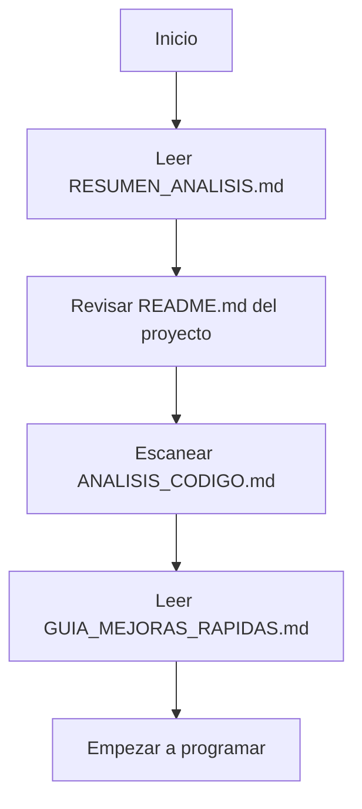
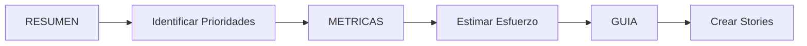
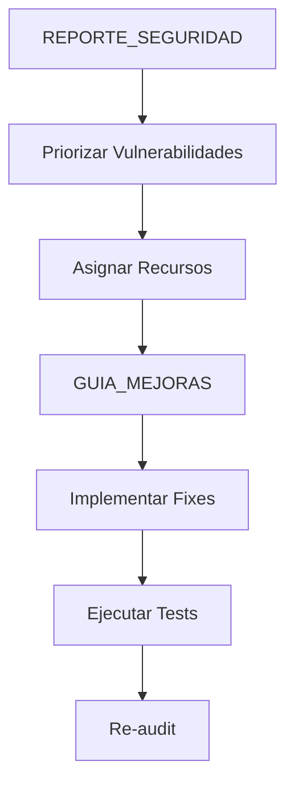

# Índice de Documentación del Análisis de Código

**Fecha:** 2025-12-11  
**Proyecto:** Evolve Soluciones  
**Análisis realizado por:** GitHub Copilot Coding Agent

---

## 📚 Documentación Disponible

Este análisis exhaustivo del código ha generado 5 documentos completos que cubren diferentes aspectos y audiencias.

---

## 🎯 Para Comenzar

### ¿No sabes por dónde empezar?

**Si eres...**

- 👔 **Manager/Product Owner** → Comienza con [`RESUMEN_ANALISIS.md`](#1-resumen-ejecutivo)
- 💻 **Desarrollador implementando cambios** → Lee [`GUIA_MEJORAS_RAPIDAS.md`](#5-guía-de-mejoras-rápidas)
- 🔒 **Security Engineer** → Ve directo a [`REPORTE_SEGURIDAD.md`](#3-reporte-de-seguridad)
- 🏗️ **Tech Lead/Arquitecto** → Revisa [`ANALISIS_CODIGO.md`](#2-análisis-técnico-completo)
- 📊 **QA/Testing Lead** → Consulta [`METRICAS_CALIDAD.md`](#4-métricas-de-calidad)

---

## 📖 Documentos del Análisis

### 1. Resumen Ejecutivo

**Archivo:** [`/RESUMEN_ANALISIS.md`](../RESUMEN_ANALISIS.md)  
**Ubicación:** Raíz del proyecto  
**Audiencia:** Management, Product Owners, Stakeholders  
**Tiempo de lectura:** 10-15 minutos

#### Contenido

- Puntuación general del proyecto (7.8/10)
- Fortalezas y vulnerabilidades principales
- Métricas clave en formato ejecutivo
- Plan de acción priorizado
- Quick wins disponibles
- Próximos pasos recomendados

#### Cuándo Leer

- ✅ Necesitas entender el estado general del proyecto
- ✅ Quieres justificar tiempo/recursos para mejoras
- ✅ Buscas un overview rápido antes de profundizar
- ✅ Necesitas comunicar el estado al equipo/management

#### Secciones Destacadas

```
├── Resultados Generales (puntuaciones por categoría)
├── Fortalezas Destacadas (lo que hace bien el proyecto)
├── Vulnerabilidades Identificadas (críticas y medias)
├── Plan de Acción Priorizado (timeline con esfuerzo)
├── Quick Wins (alto impacto, bajo esfuerzo)
└── Próximos Pasos (para cada rol)
```

---

### 2. Análisis Técnico Completo

**Archivo:** [`/ANALISIS_CODIGO.md`](../ANALISIS_CODIGO.md)  
**Ubicación:** Raíz del proyecto  
**Audiencia:** Tech Leads, Arquitectos, Desarrolladores Senior  
**Tiempo de lectura:** 30-45 minutos

#### Contenido

12 capítulos exhaustivos:

1. Arquitectura del Proyecto
2. Seguridad
3. Calidad de Código
4. Testing y Calidad
5. Dependencias y Bibliotecas
6. Configuración y Entornos
7. Rendimiento
8. Logs y Monitoreo
9. Accesibilidad y SEO
10. Prioridades de Mejora
11. Conclusiones
12. Plan de Acción Recomendado

#### Cuándo Leer

- ✅ Necesitas entender la arquitectura en profundidad
- ✅ Estás planificando refactorings mayores
- ✅ Quieres contexto técnico completo
- ✅ Necesitas evaluar decisiones arquitectónicas

#### Estadísticas del Documento

- **Páginas:** ~30
- **Palabras:** ~8,000
- **Código de ejemplo:** 15+ snippets
- **Tablas/Gráficos:** 10+

---

### 3. Reporte de Seguridad

**Archivo:** [`/documentacion/REPORTE_SEGURIDAD.md`](./REPORTE_SEGURIDAD.md)  
**Ubicación:** `documentacion/`  
**Audiencia:** Security Team, DevSecOps, Desarrolladores Senior  
**Tiempo de lectura:** 20-30 minutos  
**Clasificación:** Interno - Confidencial

#### Contenido

- Vulnerabilidades críticas identificadas (3)
- Código vulnerable con ejemplos específicos
- Soluciones detalladas con código funcional
- Tests de seguridad para cada fix
- Checklist de seguridad completo
- Plan de remediación por fases
- Headers de seguridad recomendados
- Rate limiting implementation

#### Cuándo Leer

- ✅ Necesitas corregir vulnerabilidades urgentemente
- ✅ Estás implementando mejoras de seguridad
- ✅ Quieres entender los riesgos específicos
- ✅ Necesitas código exacto para copiar/pegar

#### Vulnerabilidades Cubiertas

1. 🔴 **CRÍTICO-001:** SQL Injection por interpolación de BD
   - CVSS: 9.1 (Crítico)
   - Archivos afectados: 3
   - Solución: Validación con whitelist
   - Tiempo: 4-8 horas

2. 🟡 **MEDIO-001:** Subprocess sin validación
   - CVSS: 6.3 (Medio)
   - Archivos afectados: 1
   - Solución: Whitelist de comandos
   - Tiempo: 2-4 horas

3. 🟡 **MEDIO-002:** Emojis en código productivo
   - Impacto: Mantenibilidad
   - Archivos afectados: 2
   - Solución: Reemplazar con texto
   - Tiempo: 1-2 horas

---

### 4. Métricas de Calidad

**Archivo:** [`/documentacion/METRICAS_CALIDAD.md`](./METRICAS_CALIDAD.md)  
**Ubicación:** `documentacion/`  
**Audiencia:** QA Leads, Tech Leads, Desarrolladores  
**Tiempo de lectura:** 25-35 minutos

#### Contenido

- Análisis de tamaño de archivos
- Complejidad ciclomática
- Estado de documentación (docstrings)
- Deuda técnica (TODOs/FIXMEs)
- Convenciones de código
- Duplicación de código
- Type hints coverage
- Manejo de errores
- Performance y cuellos de botella
- Herramientas recomendadas

#### Cuándo Leer

- ✅ Estás estableciendo estándares de código
- ✅ Necesitas justificar refactoring
- ✅ Quieres implementar CI/CD quality gates
- ✅ Buscas métricas específicas para trackear

#### Métricas Principales

| Métrica | Valor Actual | Objetivo |
|---------|-------------|----------|
| Líneas de código | ~10,474 | < 50,000 |
| Cobertura tests | 0% | > 70% |
| Docstrings | 90% | > 85% |
| TODOs pendientes | 79 | < 20 |
| Duplicación | Baja | < 5% |
| Complejidad | Media | Baja-Media |

---

### 5. Guía de Mejoras Rápidas

**Archivo:** [`/documentacion/GUIA_MEJORAS_RAPIDAS.md`](./GUIA_MEJORAS_RAPIDAS.md)  
**Ubicación:** `documentacion/`  
**Audiencia:** Desarrolladores implementando las mejoras  
**Tiempo de lectura:** 15-20 minutos (+ tiempo de implementación)

#### Contenido

Guía paso a paso organizada por días/semanas:

**Semana 1:**
- Día 1: Seguridad Crítica (validador BD)
- Día 2: Headers de Seguridad
- Día 3: Rate Limiting
- Día 4-5: Tests Básicos

**Semana 2:**
- Context Managers para BD
- Agregar docstrings faltantes
- Resolver TODOs críticos

**Semana 3:**
- Eliminar emojis
- Refactoring inicial
- Optimización

#### Cuándo Usar

- ✅ Estás implementando las mejoras
- ✅ Necesitas código exacto para copiar/pegar
- ✅ Quieres seguir una secuencia lógica
- ✅ Buscas comandos específicos a ejecutar

#### Características Únicas

- ✅ Código listo para copiar/pegar
- ✅ Comandos bash específicos
- ✅ Timeline realista con horas estimadas
- ✅ Checklist de implementación
- ✅ Validación y comandos de testing
- ✅ Métricas de éxito por fase

#### Ejemplo de Formato

```markdown
### Día 1: Seguridad Crítica (4 horas)

#### 1. Crear validador de nombres de BD

**Archivo:** `aplicacion/utilidades/validadores.py`

**Agregar al final del archivo:**

```python
# Código exacto aquí...
```

**Validar con:**
```bash
python -c "from aplicacion.utilidades.validadores import validar_nombre_base_datos; ..."
```
```

---

## 🗺️ Mapa de Navegación

### Por Tipo de Tarea

#### Implementar Correcciones de Seguridad
```
1. RESUMEN_ANALISIS.md (contexto rápido)
   └─> 2. REPORTE_SEGURIDAD.md (vulnerabilidades detalladas)
       └─> 3. GUIA_MEJORAS_RAPIDAS.md (código a implementar)
```

#### Refactorizar Código Grande
```
1. ANALISIS_CODIGO.md (sección 1: Arquitectura)
   └─> 2. METRICAS_CALIDAD.md (análisis de tamaño)
       └─> 3. GUIA_MEJORAS_RAPIDAS.md (context managers)
```

#### Implementar Testing
```
1. ANALISIS_CODIGO.md (sección 4: Testing)
   └─> 2. REPORTE_SEGURIDAD.md (tests de seguridad)
       └─> 3. GUIA_MEJORAS_RAPIDAS.md (pytest setup)
```

#### Establecer Métricas CI/CD
```
1. METRICAS_CALIDAD.md (métricas completas)
   └─> 2. ANALISIS_CODIGO.md (sección 12: Plan de Acción)
```

---

## 🎯 Flujos de Trabajo Recomendados

### Para un Developer Nuevo en el Proyecto



1. ✅ Leer `RESUMEN_ANALISIS.md` (15 min)
2. ✅ Revisar `/README.md` del proyecto (10 min)
3. ✅ Escanear `ANALISIS_CODIGO.md` secciones 1-3 (20 min)
4. ✅ Leer `GUIA_MEJORAS_RAPIDAS.md` (15 min)
5. ✅ Empezar implementación

**Tiempo total:** ~1 hora de lectura

### Para Sprint Planning



1. ✅ Revisar prioridades en `RESUMEN_ANALISIS.md`
2. ✅ Consultar métricas en `METRICAS_CALIDAD.md`
3. ✅ Estimar con `GUIA_MEJORAS_RAPIDAS.md`
4. ✅ Crear stories/tasks en Jira/GitHub

### Para Security Audit



1. ✅ Leer `REPORTE_SEGURIDAD.md` completo
2. ✅ Priorizar por CVSS score
3. ✅ Asignar desarrolladores
4. ✅ Implementar con `GUIA_MEJORAS_RAPIDAS.md`
5. ✅ Ejecutar tests de seguridad
6. ✅ Re-audit después de fixes

---

## 📊 Estadísticas del Análisis

### Esfuerzo del Análisis

| Actividad | Tiempo |
|-----------|--------|
| Exploración del código | 2 horas |
| Análisis de seguridad | 2 horas |
| Análisis de calidad | 2 horas |
| Documentación | 4 horas |
| **Total** | **10 horas** |

### Documentación Generada

| Documento | Palabras | Líneas | Tamaño |
|-----------|----------|--------|--------|
| RESUMEN_ANALISIS.md | ~6,500 | ~500 | 11 KB |
| ANALISIS_CODIGO.md | ~8,000 | ~700 | 14 KB |
| REPORTE_SEGURIDAD.md | ~10,000 | ~900 | 18 KB |
| METRICAS_CALIDAD.md | ~9,000 | ~800 | 17 KB |
| GUIA_MEJORAS_RAPIDAS.md | ~8,500 | ~750 | 15 KB |
| **Total** | **~42,000** | **~3,650** | **75 KB** |

### Issues Identificados

| Categoría | Cantidad |
|-----------|----------|
| Vulnerabilidades críticas | 1 |
| Vulnerabilidades medias | 2 |
| Archivos muy grandes | 3 |
| Funciones sin docstring | 27 |
| TODOs pendientes | 79 |
| Tests faltantes | 100% |

---

## ✅ Checklist de Uso

### Para Comenzar

- [ ] He leído este índice completo
- [ ] Identifiqué mi rol/responsabilidad
- [ ] Sé qué documento(s) leer primero
- [ ] Tengo tiempo asignado para revisar la documentación
- [ ] Entiendo las prioridades del proyecto

### Después de Leer

- [ ] He compartido hallazgos con mi equipo
- [ ] He identificado tareas que puedo tomar
- [ ] He estimado el esfuerzo necesario
- [ ] He planificado cuándo implementar mejoras
- [ ] He comunicado el plan a stakeholders

---

## 🔄 Mantenimiento de esta Documentación

### Cuándo Actualizar

- ✅ Después de implementar mejoras mayores
- ✅ Cuando cambien prioridades del proyecto
- ✅ Al completar fases del plan de acción
- ✅ Si se descubren nuevas vulnerabilidades
- ✅ Cada 3 meses (review periódico)

### Quién Mantiene

- **Responsable:** Tech Lead
- **Revisor:** Security Engineer
- **Aprobador:** Engineering Manager

---

## 📞 Contacto y Soporte

### Preguntas sobre la Documentación

- **GitHub Issues:** Para discusiones técnicas
- **Email Dev Team:** dev-team@evolve-soluciones.com
- **Slack:** #codigo-calidad

### Reportar Problemas con el Análisis

- **Email:** tech-lead@evolve-soluciones.com
- **Proceso:** Crear issue con label `documentation`

---

## 🎓 Recursos Adicionales

### Dentro del Proyecto

- [`/README.md`](../README.md) - Documentación general del proyecto
- [`/DESPLIEGUE_WINDOWS_IIS.txt`](../DESPLIEGUE_WINDOWS_IIS.txt) - Guía de deployment
- [`/INTEGRACION_IA_RESUMEN.md`](../INTEGRACION_IA_RESUMEN.md) - Integración IA
- [`/.cursorrules`](../.cursorrules) - Reglas para Cursor/Copilot

### Externos

- [Flask Documentation](https://flask.palletsprojects.com/)
- [OWASP Top 10](https://owasp.org/www-project-top-ten/)
- [Python PEP 8](https://pep8.org/)
- [Pytest Documentation](https://docs.pytest.org/)

---

## 🏆 Agradecimientos

Este análisis exhaustivo fue posible gracias a:

- **GitHub Copilot** - Análisis automatizado
- **Equipo de Desarrollo** - Código base sólido
- **Management** - Tiempo asignado para análisis
- **Open Source Community** - Herramientas utilizadas

---

**Creado:** 2025-12-11  
**Última actualización:** 2025-12-11  
**Versión:** 1.0  
**Mantenido por:** Tech Lead - Evolve Soluciones

---

> **"Documentar es tan importante como desarrollar."**  
> — Equipo de Evolve Soluciones
